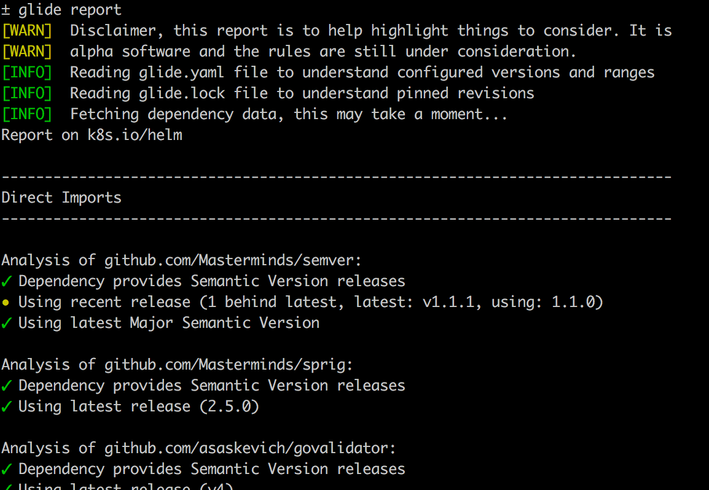

# Glide Report



This application attempts to help you determine how up to date your Go dependencies
are. It does this by examining data stored in package managers and comparing it
to the information in the projects themselves.

It does leverage [Glide](https://glide.sh). If your project is not managed by
Glide it will attempt to import it, without making any changes to your `vendor/`
directory using the Glide import functionality.

_Note, this is alpha software and should be treated as such. The reports are to
help developers start to look deeper._

## How To Install

While this is prerelease use:

```sh
$ go get -u github.com/Masterminds/glide-report
```

Once this is released a more appropriate release version will be available.

## How To Use

Change into the root of a project and run:

**If you have Glide installed:**
```sh
$ glide report
```

**If you don't have Glide installed:**
```sh
$ glide-report
```

There is an optional flag of `-no-color` if you want to turn color off in the
report. So, you can do things like:

```sh
$ glide report -no-color | pbcopy
```

On Mac this will create the report, displaying any messages, while the output
of the report will be copied to the clipboard.

## What Do Reports Look Like?

You can view a couple example reports [here](https://gist.github.com/mattfarina/d9e4bfed106af3ea8cf7f0e80a34d196) and [here](https://gist.github.com/mattfarina/fcba945cfd9efc49c284c202d7dfab92).
